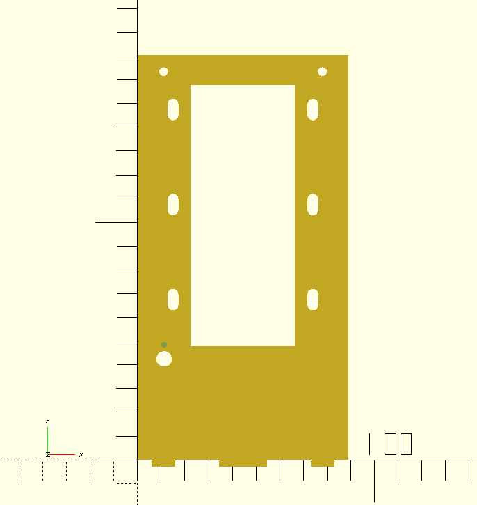
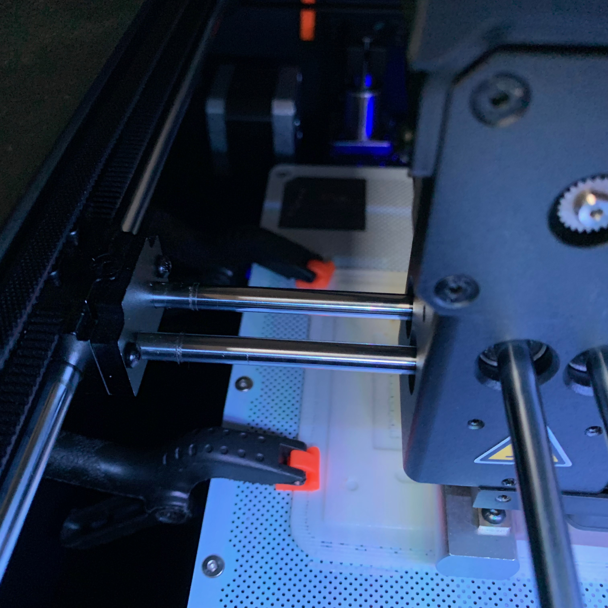

<h1>Rover 5</h1>

A repository with (hopefully) useful things related to the Rover 5 robotic platform.  
Christophe VG (<contact@christophe.vg>)  
[https://github.com/christophevg/rover5](https://github.com/christophevg/rover5)

## Introduction

See [https://www.sparkfun.com/products/10336](https://www.sparkfun.com/products/10336) for technical and commercial information.

## In this Repository

* the [cad](cad) directory contains OpenSCAD models of the Rover 5 and plates to mount various components, batteries,...
* the [images](images) directory contains PNG renderings of the model, with and without plates,...

### General

The [general](cad/general.scad) model contains variables and modules related to screws and nuts. These have to be tailored to the correct sizes of the used hardware to assemble the mount on the chassis:

* nuts and bolts: `M3 x 16`

### Rover 5

The [rover5](cad/rover5.scad) model contains a basic model of the chassis. It still requires some tweaking and parameterisation, but it's already useable as a visual support for designing add-on components.

### Mount (v2)

The [cover](cad/cover.scad), [back](cad/back.scad) and [battery](cad/battery.scad) models provide five plates that can be combined into a mount that fits on top of the chassis.

It features:

* holding space for a battery
* additional support to ensure the nuts and bolts don't break the t-bolts
* guides for keep wires clear towards the back
* two additional holes for mounting retraction hooks (4mm)

Use the [all](cad/all.scad) model to visualise it on top of the chassis:

The [cut](cad/cut.scad) model makes a 2D projection of all plates, ready for laser cutting:

The cut here also includes an empty space, in this case for a servo that rises from the chassis.

### Print version

The plexi laser cut parts proved to be a bit brittle, so for a next version, I decided to give 3D printed parts a go. Since 3D printed parts tend not to snap-fit nicely together, I had to introduce some margins.

The [print](cad/print.scad) model serves as the top-level entry point for generating 3D printable STLs. The cover was also extended with mounting holes for the servo wich and a tumble switch.

Printing the parts on my Zortrax M200 resulted in the first partly failed prints due to warping when printing the large flat cover. I managed to print the cover reasonably adding two small clamps when warping appeared. I never found a use for those clamps before; now I know why I kept them around ;-)

_More to come..._
