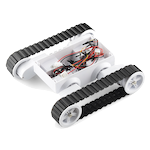

<h1>Rover 5</h1>

A repository with (hopefully) useful things related to the Rover 5 robotic platform.  
Christophe VG (<contact@christophe.vg>)  
[https://github.com/christophevg/rover5](https://github.com/christophevg/rover5)

## Introduction

See [https://www.sparkfun.com/products/10336](https://www.sparkfun.com/products/10336) for technical and commercial information.

## In this Repository

* the [cad](cad) directory contains an OpenSCAD model of the Rover 5.
* the [images](images) directory contains a PNG rendering of the model.

_More to come..._
